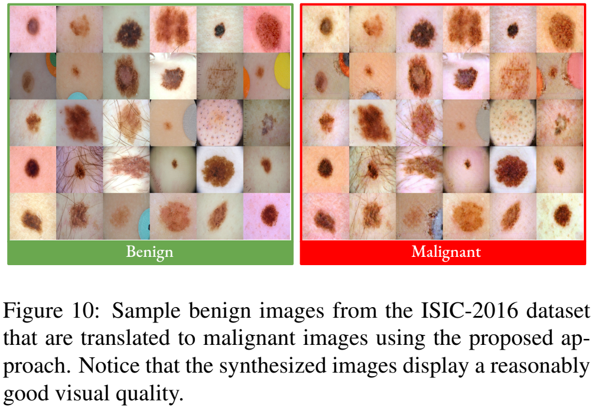
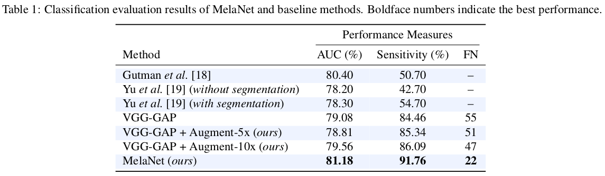
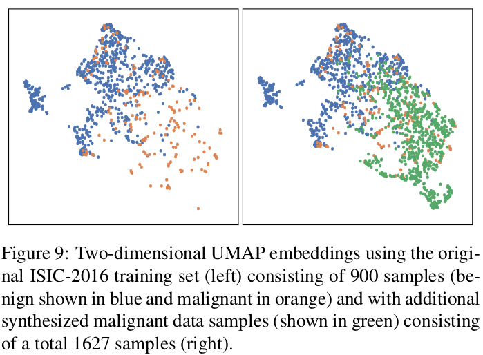

# Intro

[](https://huggingface.co/spaces/hasibzunair/melanoma-detection-demo)
[](https://aiderm.herokuapp.com/)

This is official code of Physics in Medicine and Biology paper: <br>
*Melanoma Detection using Adversarial Training and Deep Transfer Learning* (Links: [arXiv](https://arxiv.org/abs/2004.06824), [PMB](https://iopscience.iop.org/article/10.1088/1361-6560/ab86d3)).

aka How to make benign skin lesions cancerous (in images!) with Unpaired Image Translation

**TL;DR** Interclass variation is considered an intimidating remark in medical image analysis. Here we demonstrate an opposite perspective, by learning the interclass mappings (benign to malignant). And then boost the minority class (malignant) using the orginal benign images to generate synthetic malignant images and then train classification models.

<p align="left">
<a href="#"></a>
</p>


### Citation

If you use this code or models in your scientific work, please cite the
following paper:

```bibtex
@article{zunair2020melanoma,
  title={Melanoma detection using adversarial training and deep transfer learning},
  author={Zunair, Hasib and Hamza, A Ben},
  journal={Physics in Medicine \& Biology},
  year={2020},
  publisher={IOP Publishing}
}
```

### Major Requirements

This code requires

* Python: 3.6
* Tensorflow: 2.2.0
* Keras: 2.3.1

### Preparing training and test datasets

* Download dataset from 2016, Task 3 (https://challenge.isic-archive.com/data)
* Clone this repo (obviously!)
* In this directory, make a folder in `dataset` named `isic2016` and keep all files there
* To build training set and test set

```
python data_process_isic2016.py
```

* To partition the dataset for training CycleGAN (two folders malignant and benign)

```
python data_process_gan.py
``` 

You will see that this script creates two folders `trainA` and `trainB`. Due to my utter laziness, I created `testA` and `testB` folders manually which are required for visualizing the training process of the CycleGAN. For my experiments, `testA` consisted of an image from `trainA` and vice versa.

### Training (both stages)

Now that the data is partitioned according to its class label (`trainA` -> benign and `trainB` -> malignant), train CycleGAN on this data.

* Run `train_cyclegan.ipynb`

This will result in two models: `b2m.h5` and `m2b.h5` which translate from benign -> malignant and malignant -> benign respectively. For generating the minority class (malignant) using the benign samples using the translation model:

* Run `upsampler.ipynb` to oversample and balance the dataset. (Make sure you use `b2m.h5` if you train your model. The notebook uses the pretrained weight.)

Train the classification model using the oversampled and balanced dataset

* Train classifier using `train_ISIC_2016.ipynb` 

### Evaluation

The notebook `train_ISIC_2016.ipynb` consists the code to evalute on the ISIC 2016 test set.


### Pre-trained weights

Weights for translation and classification models are below. A 🤗 model card is also available [here](https://huggingface.co/hasibzunair/melanet).

| Models | Weights|
|:---:|:---:|
| Generator | [generator.h5](https://github.com/hasibzunair/adversarial-lesions/releases/latest/download/isic2016_benign_to_malignant_cyclegan_generator.h5) |
| MelaNet | [MelaNet.h5](https://github.com/hasibzunair/adversarial-lesions/releases/latest/download/MelaNet.h5) |


### Results

We report the AUC, Sensitivity and False negatives on the ISIC 2016 test set.

<p align="left">
<a href="#"></a>
</p>

UMAP embeddings of the original benign and malignant lesions (left) and with the generated malignant lesions (right). It can be seen that the generated malignant lesions are semantically more similar to the original malignant lesions than the benign lesions.

<p align="left">
<a href="#"></a>
</p>


### Reference to other models

Model definition scripts are based on https://github.com/eriklindernoren/Keras-GAN/tree/master/cyclegan and https://github.com/qubvel/classification_models.

### Deploy
* Model is packaged in a small library at [https://test.pypi.org/project/melanet/](https://test.pypi.org/project/melanet/)
* Serve model via Streamlit web app: [https://github.com/hasibzunair/melanoma-detection-demo](https://github.com/hasibzunair/melanoma-detection-demo)
* Serve model via a REST API endpoint: [https://github.com/hasibzunair/adversarial-lesions-rest-api-demo](https://github.com/hasibzunair/adversarial-lesions-rest-api-demo)
* Hugging Face Spaces Demo: [https://huggingface.co/spaces/hasibzunair/melanoma-detection-demo](https://huggingface.co/spaces/hasibzunair/melanoma-detection-demo)


### License
MIT
